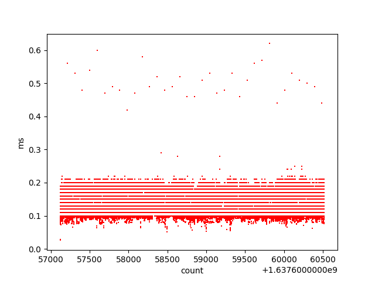
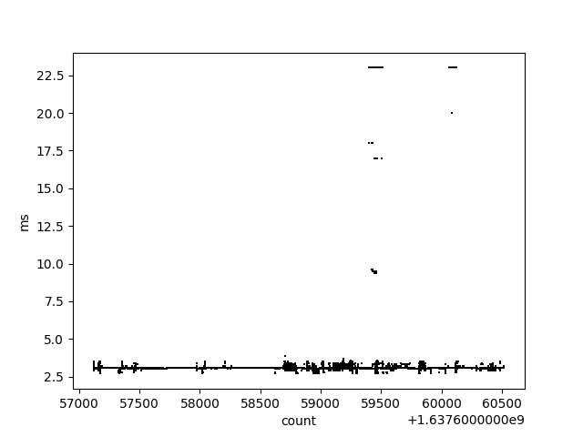
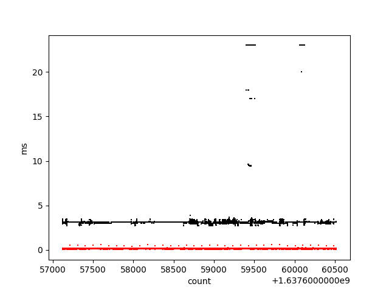

# uv_audio_video_plot
parse the uv log file and extract video and audio timings

# usage

    python graph.py -h
    usage: graph.py [-h] -l LOGFILE [-a] [-v]

    Parse timings from log file

    optional arguments:
      -h, --help            show this help message and exit
      -l LOGFILE, --logfile LOGFILE
                            log file path
      -a, --audio           Plot audio
      -v, --video           Plot video
      

# example
Example logfiles in ./logs/ and zipped

 	python graph.py -l ./logs/baremetallowlatency01.mov.stderr -a
  
  
 	
 	python graph.py -l ./logs/baremetallowlatency01.mov.stderr -v
  
  

 	python graph.py -l ./logs/baremetallowlatency01.mov.stderr -v -a
  
  